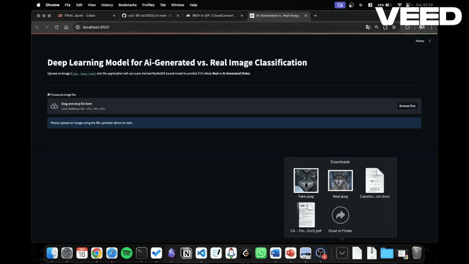

# AI Generated vs. Real Image Classification

<a href="https://iav2002-ai-image-detector.hf.space/"
   target="_blank" rel="noopener noreferrer">
  
</a>

<a href="https://colab.research.google.com/drive/1USc-AMKH1Y-cPKhVHHq-af6wlJMFRgt?usp=sharing"
   target="_blank" rel="noopener noreferrer">
  
</a>

## 👥 Authors

* **Ignacio Alarcon** [LinkedIn](https://www.linkedin.com/in/ignacioalarcon/)
* **Bernardo Gandara** [LinkedIn](https://www.linkedin.com/feed/)


## Live Demonstration

The application is deployed and running live on Hugging Face Spaces. This is the fastest way to test the model using our sample images or your own uploads.

**[Click here to try the Live App](https://iav2002-ai-image-detector.hf.space/)**

### App Preview



## Project Overview

This project leverages a **ResNet50 based Deep Learning model** to address the growing challenge of synthetic media. It detects minute digital artefacts to classify an image as either **Real (Organic)** or **AI Generated (Fake)**.

**Motivation:** We developed this model as part of our Master's in Data Science to address the "Verification Gap" the technological lag between the ability to create fake images and the ability to detect them.

### Key Features

* **Deep Learning Architecture:** Uses Transfer Learning with ResNet50.
* **Real time Analysis:** Provides instant classification with confidence scores.
* **User Friendly Interface:** Built with Streamlit for accessible usage.

## Local Setup and Execution

Follow these steps to run the application on your local machine.

### 1. Clone the Repository

```bash
git clone https://github.com/YourUsername/YourRepoName.git
cd YourRepoName
```

### 2. Set Up Environment

This project requires specific package versions. We recommend using a virtual environment to avoid conflicts.

```bash
# Create and activate virtual environment (Mac/Linux)
python3 -m venv venv
source venv/bin/activate

# Windows users:
# python -m venv venv
# .\venv\Scripts\activate

# Install dependencies
pip install -r requirements.txt
```

### 3. Run the App

The main application script is located in the `src` directory.

```bash
streamlit run src/app.py
```

## 📁 Repository Structure

```text
.
├── src/
│   ├── app.py                          # Main application entry point
│   ├── samples/                        # Sample images for testing (Real/Fake)
│   ├── files/                          # Project report and poster (PDFs)
│   └── my_ai_detector_resnet50.keras   # Trained model file
├── demo.gif                            # Preview GIF for README
├── requirements.txt                    # Python dependencies
├── runtime.txt                         # Python version configuration
└── README.md                           # This file
```


